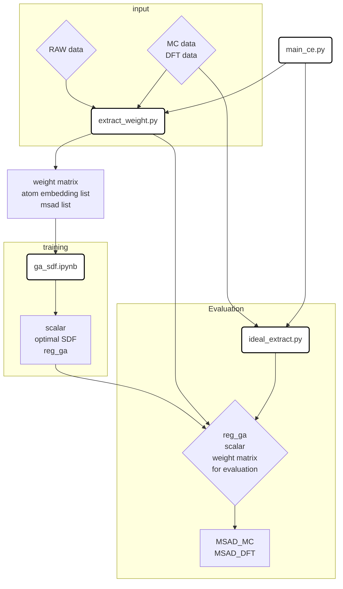

```mermaid

flowchart TD
    main_ce(main_ce.py) --> main
    
    subgraph input 
        raw{RAW data} --> main
        eva{MC data \n DFT data} --> main
    end
    eva --> ideal_extra
    main(extract_weight.py) --> data1[weight matrix \n atom embedding list \n msad list ]

    data1 --> gen(ga_sdf.ipynb)
    subgraph training
        gen --> data2[scalar \n optimal SDF \n reg_ga]
    end

    main_ce --> ideal_extra(ideal_extract.py)
    data2 --> eva_input{reg_ga \n scalar \n weight matrix \n for evaluation}
    main --> eva_input
    subgraph Evaluation
        ideal_extra --> eva_input
        eva_input --> output[MSAD_MC \n MSAD_DFT]
    end

    style main fill:#fff,stroke:#000,stroke-width:2px
    style ideal_extra fill:#fff,stroke:#000,stroke-width:2px
    style gen fill:#fff,stroke:#000,stroke-width:2px
    style main_ce fill:#fff,stroke:#000,stroke-width:2px

```
